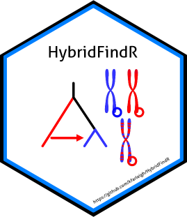

# HybridFindR 

This repository contains code for the R package HybridFindR. The goal of HybridFindR is to identify loci exhibiting signals of differential introgression.

*_Note:_ This method has not been validated in distinguishing differential introgression from genetic drift. We recommend pairing this method with demographic modeling (e.g., _Moments_ or _dadi_) and simulations (e.g., _msprime_) until it has been validated. Please see [Farleigh et al., 2023](https://onlinelibrary.wiley.com/doi/full/10.1111/mec.17170) and contact Keaka Farleigh (farleik@miamioh.edu) if you have questions.*

## Installation

You can install the development version of HybridFindR from [GitHub](https://github.com/) with:

```r
# install.packages("devtools")
devtools::install_github("kfarleigh/HybridFindR", build_vignettes = TRUE)
```

## Vignette

A vignette that walks you through differential introgression analysis can be found using:

```r 
library(HybridFindR)
vignette(topic = "Differential_Introgression_Analysis", package = "HybridFindR")
```

There is also an example data file included in the package, which you can load using the command:
```r
data("Anolis")
```

## Contact

After referring to the vignette, please direct all questions to keakafarleigh@gmail.com. 

## Citing HybridFindR
If you use HybridFindR in your work please cite:

Farleigh, K., Ascanio, A., Farleigh, M. E., Schield, D. R., Card, D. C., Leal, M., Castoe, T. A., Jezkova, T., & Rodríguez-Robles, J. A. (2023). Signals of differential introgression in the genome of natural hybrids of Caribbean anoles. _Molecular Ecology_, 32, 6000–6017. https://doi.org/10.1111/mec.17170

You should also cite:

Bailey, R. (2020). gghybrid: R package for evolutionary analysis of hybrids and hybrid zones.

Buerkle, C. A. (2005). Maximum likelihood estimation of a hybrid index based on molecular markers. Molecular Ecology Notes, 5(3), 684-687.
